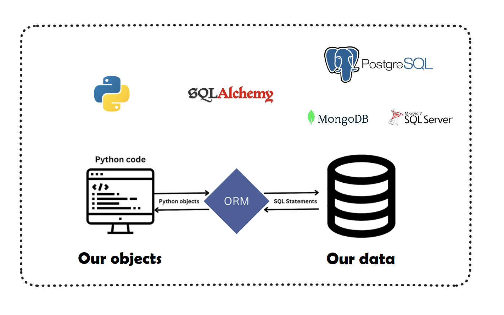

# CRUD FASTAPI POSTGRES STREAMLIT

You need to know CRUD.

The main person responsible for making this possible is the ORM



## Installation via Docker

```bash
docker-compose up -d --build
```

### Usage

Frontend:
Access the address http://localhost:8501

### Documentation

Backend:
Access the address http://localhost:8000/docs

## Our folder and file structure

```bash
├── README.md # file with project documentation
├── backend # backend folder (FastAPI, SQLAlchemy, Uvicorn, Pydantic)
├── frontend # frontend folder (Streamlit, Requests, Pandas)
├── docker-compose.yml # docker-compose configuration file (backend, frontend, postgres)
├── poetry.lock # poetry lock file
└── pyproject.toml # poetry configuration file
```

## Our Backend

Our backend will be an API, which will be responsible for communicating between our frontend and the database. Let's detail each of the folders and files in our backend.

### FastAPI

FastAPI is a web framework for building APIs with Python. It is based on Starlette, which is an asynchronous framework for building APIs. FastAPI is a framework that is growing a lot, and has a very low learning curve, as it is very similar to Flask.

### Uvicorn

Uvicorn is an asynchronous web server, which is based on ASGI, which is a specification for asynchronous web servers. Uvicorn is the web server recommended by FastAPI, and it is the server we will use in this project.

### SQLAlchemy

SQLAlchemy is a library for communicating with the database. It is an ORM (Object Relational Mapper), which is an object-relational mapping technique that allows you to communicate with the database using objects.

One of the main advantages of working with SQLAlchemy is that it is compatible with various databases, such as MySQL, PostgreSQL, SQLite, Oracle, Microsoft SQL Server, Firebird, Sybase and even Microsoft Access.

Furthermore, it performs data sanitization, preventing SQL Injection attacks.


Another point is that you can work with native Python methods, such as filter, which is widely used to create filters in lists. This makes our lives a lot easier, as we don't need to learn a new language to communicate with the database. Anyone who is familiar with Pandas will feel at home.

### Pydantic

Pydantic is a library for performing data validation. It is used by FastAPI to validate the data that is received by the API, and also to define the types of data that are returned by the API.

## docker-compose.yml

This `docker-compose.yml` file defines an application composed of three services: `postgres`, `backend` and `frontend`, and creates a network called `mynetwork`. I will explain each part in detail:

###Services:

#### Postgres:

* `image: postgres:latest`: This service uses the latest PostgreSQL image available on Docker Hub.
* `volumes`: Maps the `/var/lib/postgresql/data` directory inside the PostgreSQL container to a volume called `postgres_data` on the host system. This allows database data to persist even when the container is shut down.
* `environment`: Defines environment variables for configuring the PostgreSQL database, such as database name (`POSTGRES_DB`), user name (`POSTGRES_USER`) and password (`POSTGRES_PASSWORD`).
* `networks`: Defines that this service is on the network called `mynetwork`.

#### Backend:

* `build`: Specifies that Docker should build an image for this service, using a Dockerfile located in the `./backend` directory.
* `volumes`: Maps the `./backend` directory (on the host system) to the `/app` directory inside the container. This allows changes to the backend source code to be reflected in the container in real time.
* `environment`: Defines the `DATABASE_URL` environment variable, which specifies the URL to connect to the PostgreSQL database.
* `ports`: Maps port `8000` of the host system to port `8000` of the container, allowing the service to be accessed through port `8000`.
* `depends_on`: Indicates that this service depends on the `postgres` service, ensuring that the database is ready before the backend is started.
* `networks`: Also defines that this service is on the `mynetwork` network.

#### Frontend:

* `build`: Similar to the backend, it specifies that Docker should build an image for this service, using a Dockerfile located in the `./frontend` directory.
* `volumes`: Maps the `./frontend` directory (on the host system) to the `/app` directory inside the container, allowing for real-time changes.
* `ports`: Maps port `8501` of the host system to port `8501` of the container, allowing access to the frontend through port `8501`.
* `networks`: Defines that this service is also on the `mynetwork` network.

### Networks:

* `mynetwork`: Defines a custom network for services to communicate with each other.

### Volumes:

* `postgres_data`: Defines a volume to store PostgreSQL database data.

### `docker-compose up` command:

When you run `docker-compose up`, Docker Compose will read the `docker-compose.yml` file, create the services as per the specified definitions, and start them. This means that containers for the PostgreSQL database, backend and frontend will be created and connected to the `mynetwork` network. The database will be configured with the provided details (database name, user and password), and the images for the backend and frontend services will be built from the provided Dockerfiles. Once launched, you will be able to access the backend through `http://localhost:8000` and the frontend through `http://localhost:8501`. Database data will be persisted on the `postgres_data` volume.

## Our folder and file structure

```bash
├── backend
│ ├── Dockerfile # Docker configuration file
│ ├── crud.py # file with CRUD functions using SQL Alchemy ORM
│ ├── database.py # file with database configuration using SQL Alchemy
│ ├── main.py
│ ├── models.py
│ ├── requirements.txt
│ ├── router.py
│ └── schemas.py
```
## Our Frontend

Our frontend will be an application that will consume our API, and will be responsible for registering, changing and removing products. Let's detail each of the folders and files in our frontend.

### Streamlit

Streamlit is a library for building web applications with Python. It is widely used to build dashboards, and also to build applications that consume APIs.

### Requests

Requests is a library for making HTTP requests with Python. It is widely used to consume APIs, and also for web scraping.

### Pandas

Pandas is a library for manipulating data with Python. It is widely used to perform data analysis, and also to build dashboards.


## Deploy <> Under construction


### AWS ECS

Furthermore, in this project we will present how to put a project into production using Docker containers, using AWS ECS (Amazon Elastic Container Service).

If you want to have all the ease of Docker, ensure that your development and production environments are identical, and still have the possibility of scaling your application, this project is for you.

AWS ECS is a container orchestration service that allows you to run Docker containers in a scalable and highly available way. With it, you don't have to worry about the infrastructure, as AWS takes care of everything for you.

### AMAZON ECS

It is a container orchestration service, which allows you to run Docker containers in a scalable and highly available way. The main advantage is that you don't need to worry about container orchestration (Kubernetes) but have all the advantages of using Docker containers.

### AMAZON ECS FARGATE

ECS Fargate is a service that allows you to run Docker containers without having to manage servers. In other words, all server management, load balancing, auto scaling, etc., is done by AWS. It's an even more managed service than ECS, as you don't have to worry about the infrastructure.